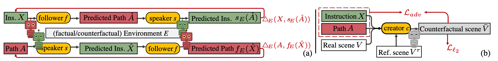

# CCC-VLN
Repository of our CVPR2022 paper "Counterfactual Cycle-Consistent Learning for Instruction Following and Generation in Vision-Language Navigation"
[[Paper]]()

<div align="center">
    
    
</div>

## Environment Installation
Download Room-to-Room navigation data:
```
bash ./tasks/R2R/data/download.sh
```

Download image features for environments:
```
mkdir img_features
wget https://www.dropbox.com/s/o57kxh2mn5rkx4o/ResNet-152-imagenet.zip -P img_features/
cd img_features
unzip ResNet-152-imagenet.zip
```

Python requirements: Need python3.6.
```
conda create -n ccc python=3.6
conda activate ccc
pip install -r python_requirements.txt
```

Install Matterport3D simulators:
```
git submodule update --init --recursive 
sudo apt-get install libjsoncpp-dev libepoxy-dev libglm-dev libosmesa6 libosmesa6-dev libglew-dev
mkdir build && cd build
cmake -DEGL_RENDERING=ON ..
make -j8
```

## Usage

### Agent Training
Using the following scripts to train the speaker and the follower with 2 GPUs.
``` bash
conda activate ccc
model=SSM
python -u -m torch.distributed.launch \
    --use_env \
    --nproc_per_node 2 \
    $model/train.py
```
It is recommended to use a pre-trained checkpoint with imitation learning to initialize the speaker and the follower for fast training. 
```
python -u -m torch.distributed.launch \
    --use_env \
    --nproc_per_node 2 \
    $model/train.py \
    --nav_path ${PATH_TO_FOLLOWER} \
    --speaker_path ${PATH_TO_SPEAKER} \
```
The pre-trained SSM model is available in [GoogleDrive](https://drive.google.com/file/d/15mINW_HOxweO-OX2W-LZN_5YoZXpzmNV/view?usp=sharing).

### Agent Evaluation
Run the following scripts to evaluate the follower.
``` bash
python $model/eval_agent.py
```
Run the following scripts to evaluate the speaker.
``` bash
python $model/eval_speaker.py
```
<!-- The trained model for R2R task is available in [GoogleDrive](https://drive.google.com/file/d/15mINW_HOxweO-OX2W-LZN_5YoZXpzmNV/view?usp=sharing). Please download the checkpoint file under `snap/SSM/state_dict` path and run the following script to evaluate the model.
``` bash
cd ssm
python model_eval.py
``` -->


## Citation
Please cite this paper in your publications if it helps your research:
```
@inproceedings{wang2022counterfactual,
      title={Counterfactual Cycle-Consistent Learning for Instruction Following and Generation in Vision-Language Navigation}, 
      author={Hanqing Wang, and Wenguan Wang, and Wei Liang, and Jianbing Shen, and Luc Van Gool},
      booktitle=CVPR,
      year={2022}
}
```


## TODO's
1. [ ] Tidy the code for other navigation agents.
2. [ ] Release the checkpoints.


## Contact Information
- hanqingwang[at]bit[dot]edu[dot]cn, Hanqing Wang
- wenguanwang[dot]ai[at]gmail[dot]com, Wenguan Wang